---
title: "Webscraping with Selenium and BeautifulSoup"
author: [Thomas Jonas]
date: "2019-06-16"
subject: "Markdown"
keywords: [Markdown]
lang: "en"
fontsize: 10pt
code-block-font-size: \tiny
# Possible sizes are 8pt, 9pt, 10pt, 11pt, 12pt, 14pt, 17pt, 20pt
width:
  image: 60
  text: 40
# Pandoc varialbes do not work. Changing everything manually is only okay for prototyping presentations.
# Dont use this for long documents or presentations.
...


# Ziel

- Automatisiertes Webscraping
- Datenhaltung in Zeitreihen-Datenbank
- Darstellung durch Dashboard
- Deployment in Docker-Umgebung


# Inhaltsangabe

- Übersicht genutzter Technoligien
- Implementierung & Konfiguration
- Probleme
- Fazit


# Webscraping

## Selenium

- Webscraping von dynamischen single-page Webseiten.
- Nutzt Browser (chrome-driver muss installiert sein.)

## BeatuifulSoup

- Suche nach Klassen und Tags innerhalb HTML-Code.
- Light-weight

# Zeitreihen Datenbank

## influxDB

- Schreiben/Lesen von Zeitreihen-Daten.
- Meist genutzte ZR-DB.
- Push-basiert.

## Prometheus

- Sammelt Metriken über zB CPU-Auslastung
- Pull-basierte Datenbank

# Dashboard

## Grafana

- Interactive Web-application.
- Erstellen anschaulicher Graphen und Diagramme.
- Mehrere Datenquellen möglich.


# Deployment

## Docker

- OS-level Virtuallisierung. Verpacken von Software in Container.


# Implementierung: Webscraping

:::::::::::: {.columns}
::: {.column width=50%}
{ width=100%}
:::
::: {.column width=50%}
{ width=100%}
:::
::::::::::::

# Implementierung: Webscraping

:::::::::::: {.columns}
::: {.column width=60%}
{ width=100%}
:::
::: {.column width=40%}
- Selenium ermöglicht Navigation auf Webseiten.
- Auswahl, Ausführung und Änderung von Elementen. 
:::
::::::::::::


# Implementierung: Webscraping - Selenium

```py
service_object = Service(binary_path)
# Invoke new browser window & enable headless mode
chrome_options = Options()
chrome_options.add_argument("--headless")
chrome_options.add_argument("--window-size=1920x1080")
chrome_options.add_argument('--no-sandbox')
chrome_options.add_argument('--disable-gpu')
driver = webdriver.Chrome(service=service_object, options=chrome_options)

# Navigate to website
driver.get("https://pegel.bonn.de/php/rheinpegel.php")
# Select button element
show_table_button = driver.find_element(by='id', value='btn_table')
# Click button
show_table_button.click()
# Retrieve generated HTML element by id
waterlevel_data_element = driver.find_elements(by='id', value='dataTable')
# Get innerHTML content of table
waterlevel_data_html = waterlevel_data_element[0].get_attribute(
    name='innerHTML')
driver.close()
```

# Implementierung: Webscraping - BeautifulSoup

```py
# BeautifulSoup used to retrieve elements inside specific HTML-tags.
    
# Create Soup from HTML
soup = BeautifulSoup(waterlevel_data_html, 'html.parser')
# Find all table rows
table_rows = soup.find_all('tr')
table_header = table_rows[0].text
table_data = table_rows[1:]
# Split into single td (tabledata) elements
html_rows = [BeautifulSoup(str(table_data[i]), 'html.parser').find_all('td')
                for i in range(len(table_data))]
rows = [[row[0].text, row[1].text] for row in html_rows]
date_time_raw = [row[0] for row in rows]
waterlevel_raw = [row[1] for row in rows]

return date_time_raw, waterlevel_raw
```


# Implementierung: Datenhaltung - influxDB


```py

def map_duplicates_to_24_hour_format(dataFrame):
    ...

def set_index_column_time(dataframe):
    ...

def write_to_influxdb(dataframe):
    client = InfluxDBClient(url=f"http://{INFLUXDB_URL}:8086",
                            token=influx_token, org=influx_org)
    write_api = client.write_api(write_options=SYNCHRONOUS)
    write_api.write(influx_bucket, influx_org, record=dataframe,
                    data_frame_measurement_name='waterlevel',
                    data_frame_tag_columns=['waterlevel'])
    write_api.close()
    client.close()
```


# Dashboard - influxDB


:::::::::::: {.columns}
::: {.column width=60%}
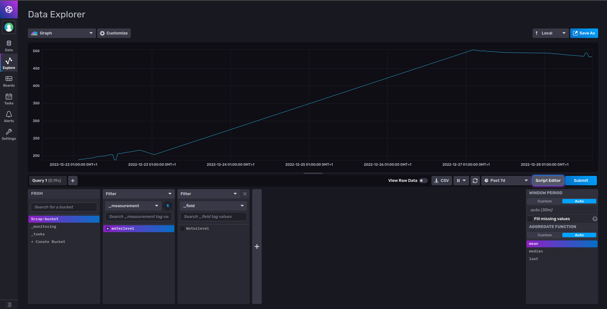{ width=100%}

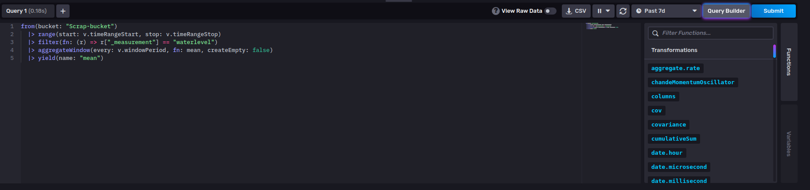{ width=100%}
:::
::: {.column width=40%}
- Query Builder
- Script Editor (hilfreich für Grafana)
:::
::::::::::::

# Dashboard - Grafana


:::::::::::: {.columns}
::: {.column width=60%}
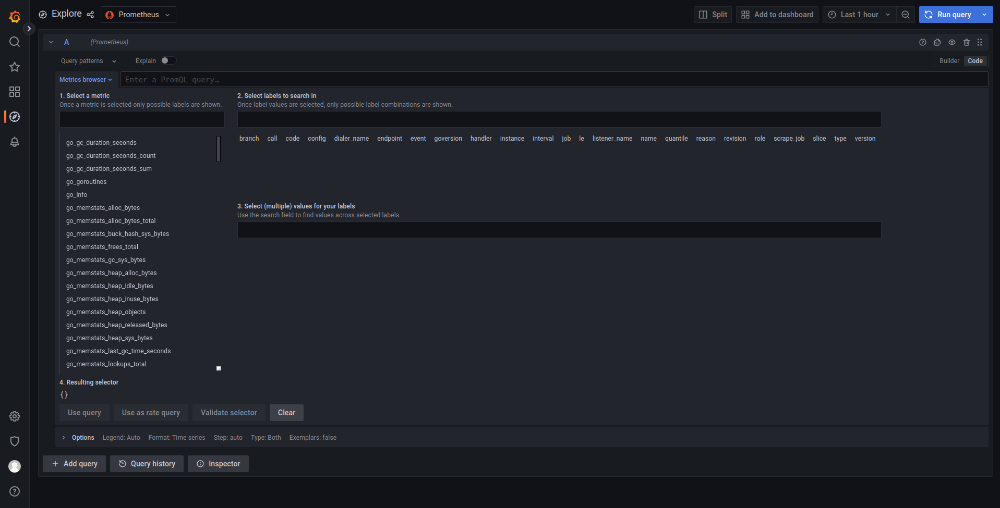

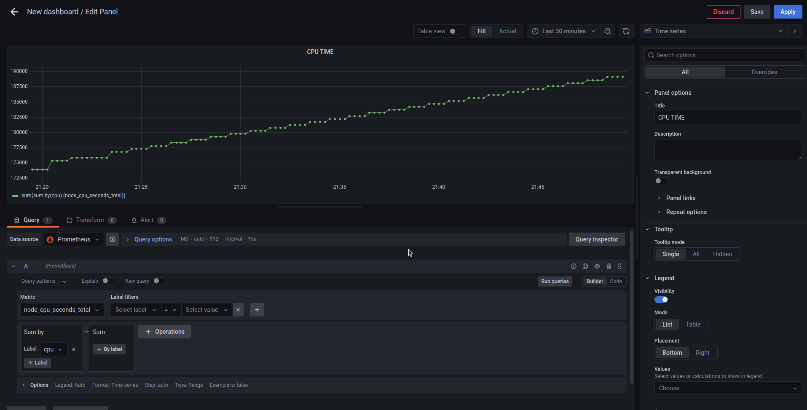
:::
::: {.column width=40%}
- Prometheus als Datenquelle hinzugefügt.
- Monitoring unterschieldlicher Metriken. zB CPU-Auslastung
:::
::::::::::::


# Dashboard - Grafana 


:::::::::::: {.columns}
::: {.column width=60%}
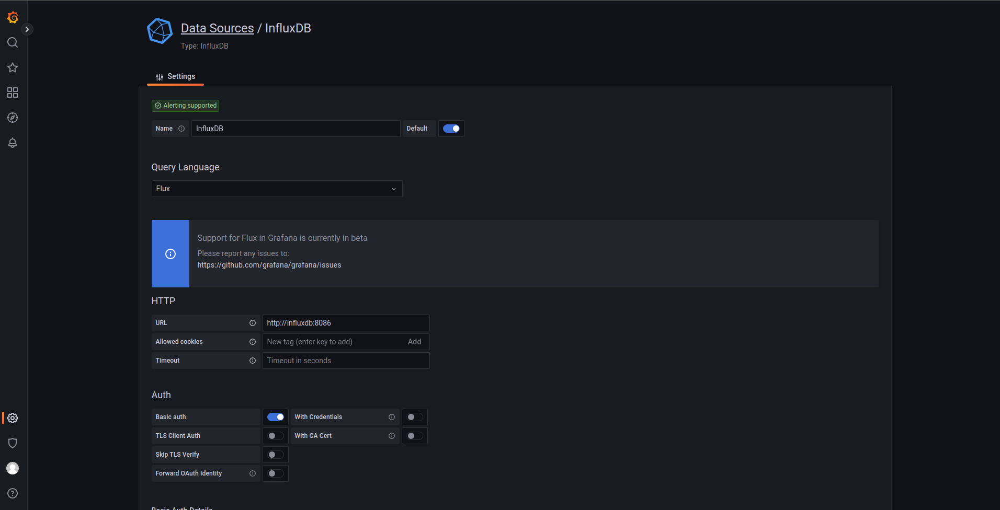

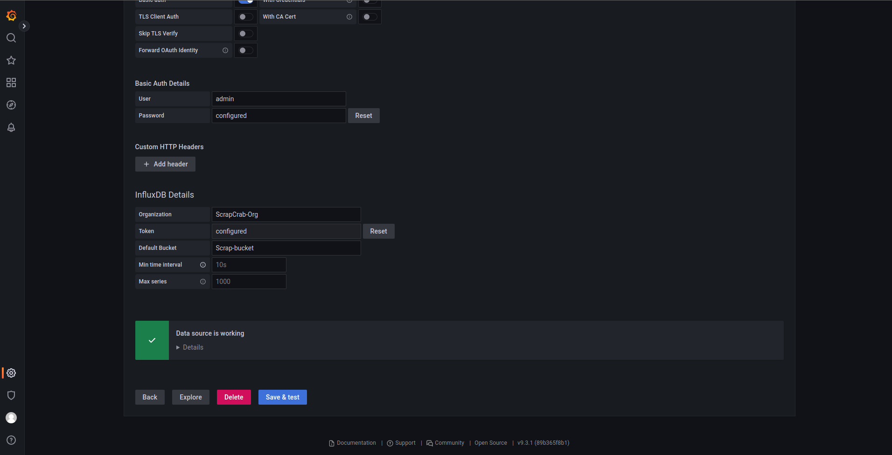

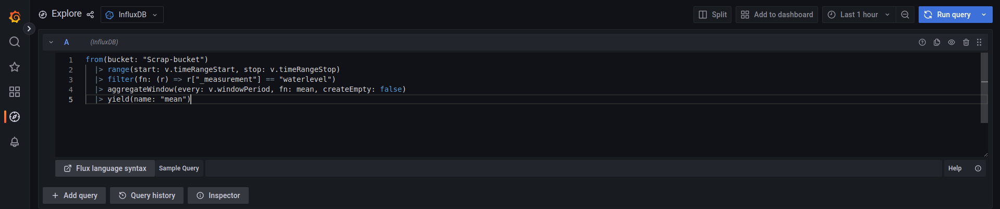

:::
::: {.column width=40%}
- influxDB als Datenquelle hinzufügen.
- Credentials durch .env-Variablen in influxDB container gesetzt.
- Query aus influxDB-UI einfügen.
:::
::::::::::::

# Dashboard - Grafana 

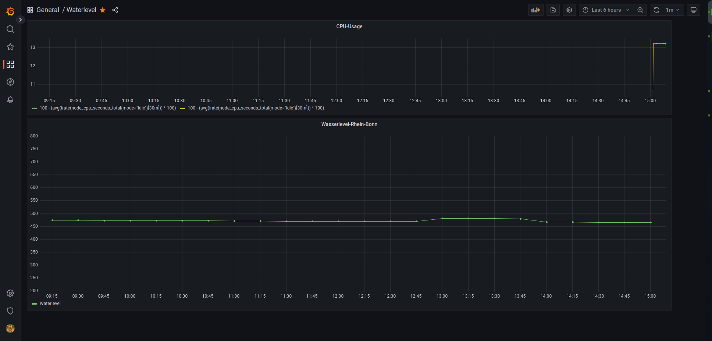


# Deployment: docker-compose


:::::::::::: {.columns}
::: {.column width=50%}
```yaml
version: '3.8'
services:
  influxdb:
    container_name: influxdb
    image: influxdb:2.0
    volumes:
      - ./influx/database:/var/lib/influxdb2
    env_file:
      - .env
    environment:
      - DOCKER_INFLUXDB_INIT_MODE=setup
      - DOCKER_INFLUXDB_INIT_USERNAME=${influx_user}
      - DOCKER_INFLUXDB_INIT_PASSWORD=${influx_pw}
      - DOCKER_INFLUXDB_INIT_ORG=${influx_org}
      - DOCKER_INFLUXDB_INIT_BUCKET=${influx_bucket}
      - DOCKER_INFLUXDB_INIT_ADMIN_TOKEN=${influx_token}
    ports:
      - "8086:8086"
  
  web-scraper:
    container_name: scrapcrab
    image: scrapcrab:0.1
    env_file:
      - .env
    environment:
      - INFLUXDB_URL=influxdb
      - REFRESH_INTERVAL_MINUTES=30
    command: python scheduled_scraper.py
    depends_on: 
      - influxdb
```
:::
::: {.column width=50%}
```yaml
prometheus:
    image: prom/prometheus:latest
    container_name: prometheus
    restart: unless-stopped
    volumes:
      - ./prometheus.yml:/etc/prometheus/prometheus.yml
      - prometheus_data:/prometheus
    command:
      - '--config.file=/etc/prometheus/prometheus.yml'
      - '--storage.tsdb.path=/prometheus'
      - '--web.console.libraries=/etc/prometheus/console_libraries'
      - '--web.console.templates=/etc/prometheus/consoles'
      - '--web.enable-lifecycle'
    ports:
      - 9090:9090

  grafana:
    image: grafana/grafana-oss:9.3.1-ubuntu
    container_name: grafana
    ports:
        - 3000:3000
    volumes:
      - ./grafana:/var/lib/grafana
    user: "0:0"
    environment:
        GF_SECURITY_ADMIN_PASSWORD: grafana_totaly_secure_password

volumes:
  prometheus_data: {}
```
:::
::::::::::::

# Probleme

## Docker-Images Zugriffsrechte

:::::::::::: {.columns}
::: {.column width=60%}

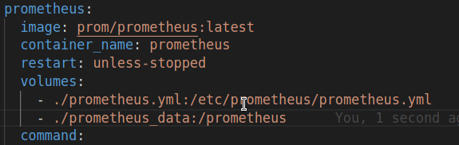


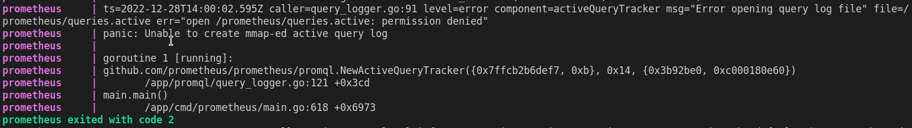


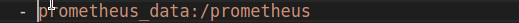

:::
::: {.column width=40%}

- Fehlende Zugriffsrechte verursache bei Prometheus/ Grafana Images oft Probleme.

- Lösung: Docker Volumes
:::
::::::::::::

# Genutzte Technologien


:::::::::::: {.columns}
::: {.column width=33%}


\


:::
::: {.column width=33%}


\


:::

::: {.column width=33%}

{width=100%}

\

{width=100%}

:::
::::::::::::


# TODO

- Page-Nummern einfuegen
- Datum und Author auf jeder Folie


<!-- Create beamer .pdf from .md -->
<!-- pandoc Presentation.md -o beamer.pdf --from markdown --to beamer --template "/home/thomas/.pandoc/templates/eisvogel.latex" --listings -->