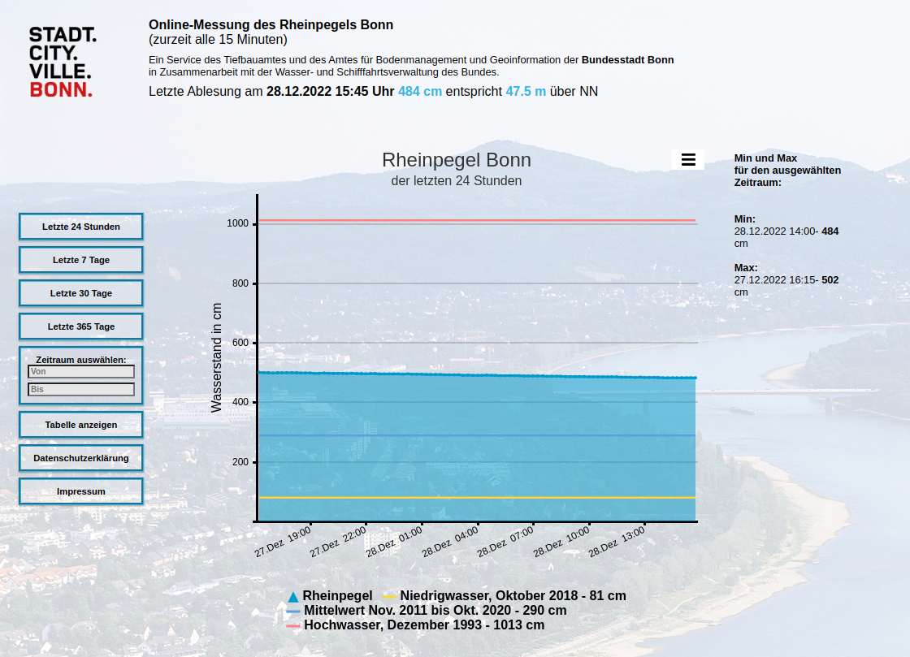
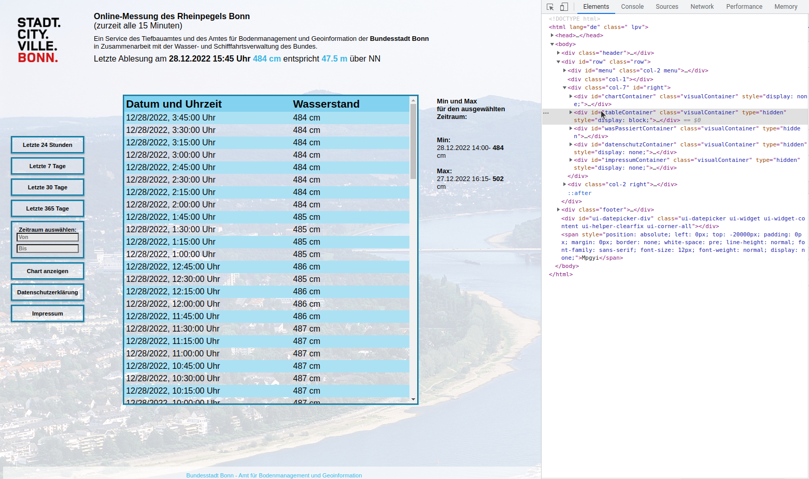

---
title: "Webscraping with Selenium and BeautifulSoup"
author: [Thomas Jonas]
date: "2019-06-16"
subject: "Markdown"
keywords: [Markdown]
lang: "en"
...

# Ziel

- Automatisiertes Webscraping
- Datenhaltung in Zeitreihen-Datenbank
- Darstellung durch Dashboard
- Deployment in Docker-Umgebung

# Inhaltsangabe

- Übersicht genutzter Technoligien
- Implementierung & Konfiguration
- Probleme
- Fazit

# Webscraping

## Selenium

- Webscraping von dynamischen single-page Webseiten.
- Nutzt Browser (chrome-driver muss installiert sein.)

## BeatuifulSoup

- Suche nach Klassen und Tags innerhalb HTML-Code.
- Light-weight

# Zeitreihen Datenbank

## influxDB

- Schreiben/Lesen von Zeitreihen-Daten.
- Meist genutzte ZR-DB.
- Push-basiert.

## Prometheus

- Sammelt Metriken über zB CPU-Auslastung
- Pull-basierte Datenbank

# Dashboard

## Grafana

- Interactive Web-application.
- Erstellen anschaulicher Graphen und Diagramme.
- Mehrere Datenquellen möglich.

# Deployment

## Docker

- OS-level Virtuallisierung. Verpacken von Software in Container.

# Implementierung: Webscraping

:::::::::::: {.columns}
::: {.column width=50%}
{ width=100%}
:::
::: {.column width=50%}
{ width=100%}
:::
::::::::::::

# Implementierung: Webscraping

:::::::::::: {.columns}
::: {.column width=60%}
{ width=100%}
:::
::: {.column width=40%}
- Selenium ermöglicht Navigation auf Webseiten.
- Auswahl, Ausführung und Änderung von Elementen. 
:::
::::::::::::

# Genutzte Technologien

# TODO

- Page-Nummern einfuegen
- Datum und Author auf jeder Folie

<!-- Create beamer .pdf from .md -->
<!-- pandoc Presentation.md -o beamer.pdf --from markdown --to beamer --template "/home/thomas/.pandoc/templates/eisvogel.latex" --listings -->